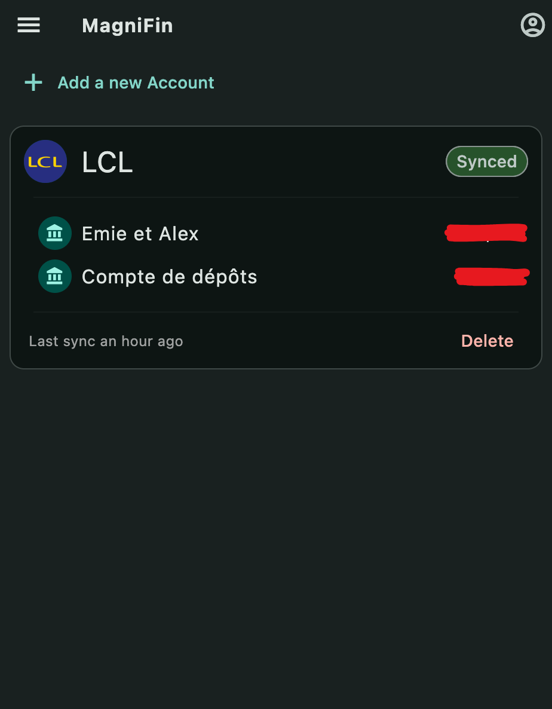

# Project MagniFin 

<div>
  
  <div style="display: inline-block; width: calc(100% - 70px)">
    MagniFin is a self-hosted app designed to simplify financial management by aggregating all your bank accounts in one
    place. It helps you track your budget, monitor expenses, and manage investments effortlessly, giving you full control
    over your financial data.
  </div>
</div>

## Features

- **Bank Account Aggregation**: Connect all your bank accounts in one place. It is using external providers to connect
  to your bank and retrieve al the data. Supported providers are:
    - [GoCardless](https://gocardless.com/bank-account-data/)
    - More to come (see [Add new providers](https://github.com/jochy/magnifin/issues/11)
    - And a homemade provider to come (see [Add new providers](https://github.com/jochy/magnifin/issues/12))
- **Transaction enrichment**: Enrich the data collected by the providers, in order to extract the maximum information
  from the transaction. For example, compute the merchant name and retrieve its logo from raw transaction data.
- **Transaction Categorization**: Automatically categorise your transactions and track your expenses. Uses a local AI to
  categorise the transactions, plus you can define custom rules. The AI will learn from your rules for the next incoming
  transactions.
- **Budgeting**: Track your spending by month. More to come (like setting up a budget per category, etc.).

Currently only built on web, but the plan is to build a mobile app as well. The frontend is built using Flutter, so the
cross-platform will be easy to achieve.

<p>
  
  
  
  
</p>

## Roadmap:

- **Investment tracking**: Track your investments and see how they are performing.
- **Net Worth Tracking**: Track your net worth over time.
- **Reports**: Generate reports to get insights into your financial data.
- **Budgeting**: Set up budgets and track your spending. Add notifications.

## Getting Started

Create an account on the provider you want to use to connect your bank account. You can use on of them:

- [GoCardless](https://gocardless.com/bank-account-data/)

Then, you can clone the repository and create a `.env` file, based on the `.env.example` file. Here are the settings:

| Variable Name         | Description                                                              | Required | Default Value          |
|-----------------------|--------------------------------------------------------------------------|----------|------------------------|
| PORT                  | The port on which the server will run                                    | No       | 8080                   |
| JWT_SIGN_KEY          | The key used to sign the JWT token for the authentication part.          | Yes      |                        |
| CYPHER_KEY            | The key used to encrypt the data in the db.                              | Yes      |                        |
| PUBLIC_URL            | The public URL of the server                                             | Yes      |                        |
| BACKEND_URL           | The URL of the backend server (used only for the web version)            | Yes      |                        |
| DB_HOST               | The host of the database                                                 | Yes      |                        |
| DB_PORT               | The port of the database                                                 | Yes      |                        |
| DB_USERNAME           | The username to connect to the database                                  | Yes      |                        |
| DB_PASSWORD           | The password to connect to the database                                  | Yes      |                        |
| DB_NAME               | The name of the database                                                 | Yes      |                        |
| DB_DATABASE           | The name of the database                                                 | Yes      |                        |
| OPENAI_BASE_URL       | The base URL of the OpenAI API                                           | No       | https://api.openai.com |
| OPENAI_KEY            | The key to connect to the OpenAI API. Used only if remote AI.            | No       |                        |
| OPENAI_MODEL          | The model to use for the OpenAI API. Required if KEY or BASE_URL is set  | No       |                        |
| GOCARDLESS_SECRET_ID  | The client ID of the GoCardless API. Required if GoCardless is used.     | No       |                        |
| GOCARDLESS_SECRET_KEY | The client secret of the GoCardless API. Required if GoCardless is used. | No       |                        |

Then you can run the stack with the following commands:

```bash
docker-compose up -d .
```

And you can access the app on `http://localhost:3000`.